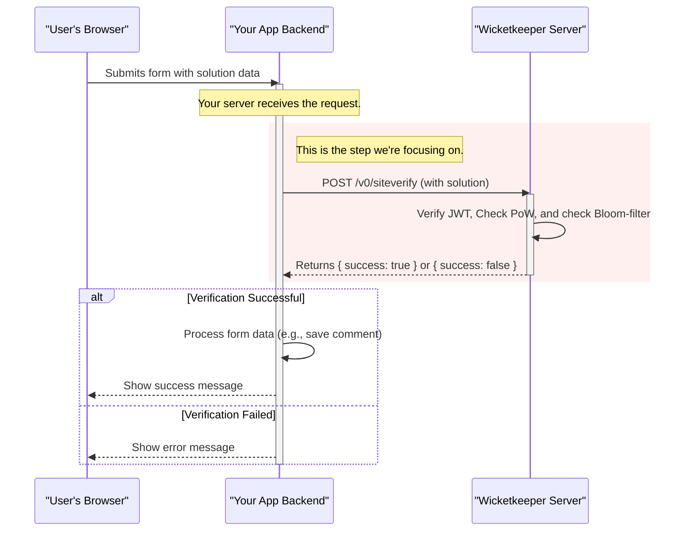

# Verifying on Your Backend

You have successfully integrated the Wicketkeeper widget into your frontend form. When a user solves the captcha and submits the form, the solution is sent to _your_ application's backend.

This final, crucial step is to have your backend verify the solution with the Wicketkeeper server. This is a secure, server-to-server interaction that confirms the user is not a bot before you process their data.

## The Verification Flow

The diagram below highlights the part of the process this page focuses on: the communication between **Your App Backend** and the **Wicketkeeper Server**.



The logic your backend needs to implement is straightforward:

1.  **Receive** the form submission from the user's browser.
2.  **Extract** the Wicketkeeper solution string from the request body (e.g., from the `wicketkeeper_response` field).
3.  **Parse** this string from JSON into an object.
4.  **Send** this object in a `POST` request to your Wicketkeeper server's `/v0/siteverify` endpoint.
5.  **Evaluate** the JSON response from the Wicketkeeper server.
6.  **Proceed** with your application logic (like saving a user comment) only if the verification was successful.

## Example: Node.js + Express

The `example/` application provides a perfect, real-world example of this flow using Node.js, Express, and TypeScript. The core logic is shown below.

::: tip Any Language Will Do
While this example uses Node.js, the principle is universal. It is a standard HTTP POST request that can be implemented in any backend language, such as Python, PHP, Ruby, Java, or C#.
:::

```typescript{2,11-17,20-29,32-35}
// example/src/server.ts
import express, { Request, Response } from "express";
import axios from "axios";

const app = express();
app.use(express.urlencoded({ extended: true }));
app.use(express.json());

const VERIFY_URL =
  process.env.VERIFY_URL || "http://localhost:8080/v0/siteverify";

app.post("/submit", async (req: Request, res: Response) => {
  // 1. Extract the solution from the request body
  const { name, email, wicketkeeper_response } = req.body;

  if (!wicketkeeper_response) {
    return res.status(400).send("⚠️ Missing Wicketkeeper solution");
  }

  // 2. Parse the JSON string into an object
  let solution: { token: string; nonce: number; response: string };
  try {
    solution = JSON.parse(wicketkeeper_response);
  } catch {
    return res.status(400).send("⚠️ Invalid Wicketkeeper payload");
  }

  // 3. Send the solution to the Wicketkeeper server for verification
  try {
    const verifyRes = await axios.post(VERIFY_URL, solution, {
      headers: { "Content-Type": "application/json" },
    });

    // 4. Check if verification was successful
    if (!verifyRes.data || verifyRes.data.success !== true) {
      console.warn("Wicketkeeper verify failed:", verifyRes.data);
      return res.status(400).send("🚫 Wicketkeeper verification failed");
    }
  } catch (err: any) {
    // 5. Handle errors if the Wicketkeeper server is down or returns an error
    console.error("Verification error:", err.response?.data || err.message);
    return res.status(500).send("❌ Verification service error");
  }

  // 6. If successful, proceed with your application logic
  console.log("✅ Form received:", { name, email });
  res.send(`Thanks, ${name}! We've received your email (${email}).`);
});

app.listen(8081, () => {
  console.log(`🚀 Server listening on http://localhost:8081`);
});
```

### Breakdown of the Code

1.  **Extract the Solution**: The code first gets the `wicketkeeper_response` string from the POST body. If it's missing, it immediately returns a `400 Bad Request` error.

2.  **Parse the JSON**: The `wicketkeeper_response` is a JSON string. `JSON.parse()` converts it into the object that the Wicketkeeper server expects. This object contains the `token`, `nonce`, and `response`.

3.  **POST to `/v0/siteverify`**: Using `axios` (or any other HTTP client), the code sends the parsed `solution` object to the `VERIFY_URL`. The `Content-Type` header must be set to `application/json`.

4.  **Check for Success**: The most important check is `verifyRes.data.success === true`. The Wicketkeeper server will explicitly tell you if the verification passed. If `success` is not `true`, you should treat the submission as invalid and return an error.

5.  **Handle Service Errors**: The `catch` block handles network errors or 5xx responses from the Wicketkeeper server (e.g., it can't connect to Redis). In this case, your application should return a `500 Internal Server Error` to the user, as the problem is on the server side, not with the user's submission.

6.  **Proceed with Logic**: Only after all checks have passed does the code proceed to the core application logic (in this case, logging the data and sending a success message).
